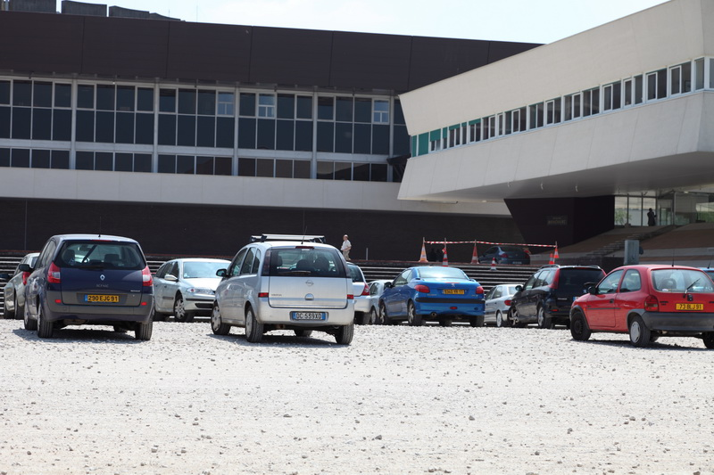
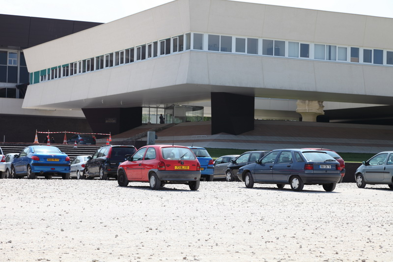
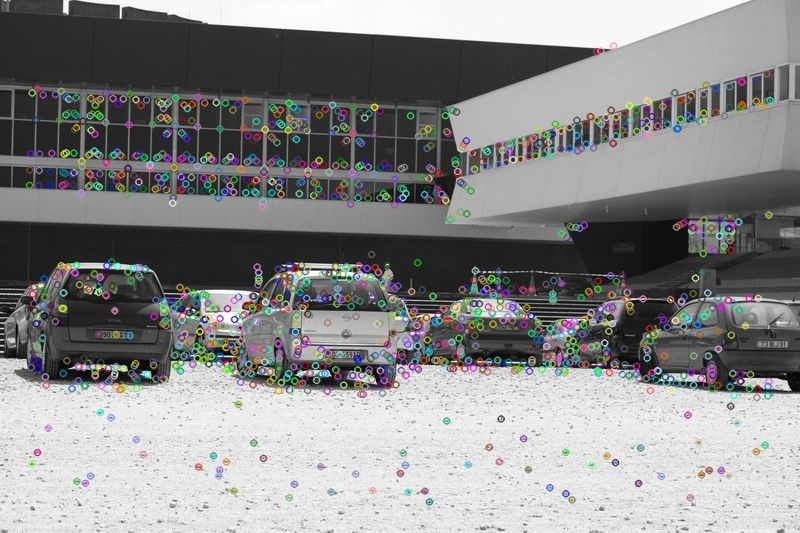
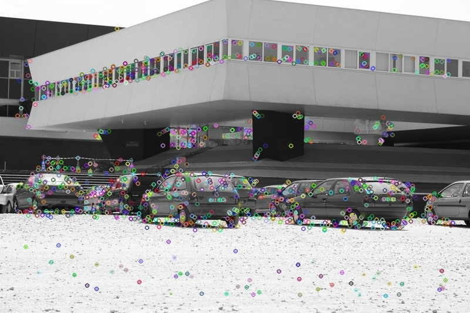
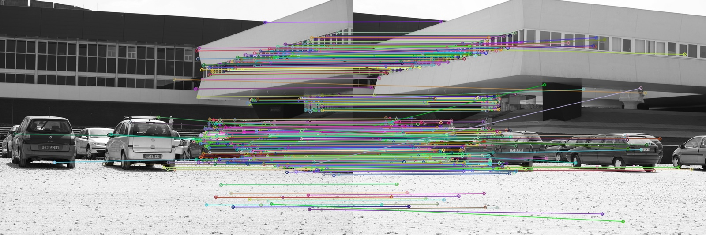
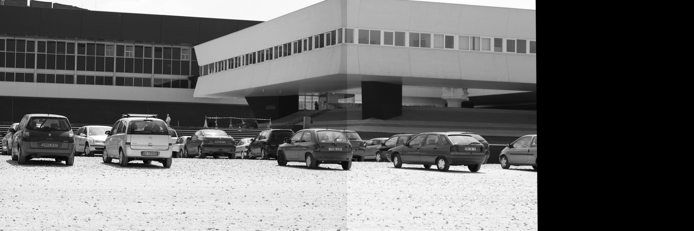

# image-registration

Image registration is the process of transforming different images of one scene into the same coordinate system. You can find more about it in [this wonderful article](https://www.sicara.ai/blog/2019-07-16-image-registration-deep-learning).

We will use [AKAZE](https://vovkos.github.io/doxyrest-showcase/opencv/sphinx_rtd_theme/page_tutorial_akaze_matching.html) local features from [OpenCV 2D Features framework](http://www.bmva.org/bmvc/2013/Papers/paper0013/paper0013.pdf) to detect and match keypoints on two images. These matching keypoints will allow us to compute the [homography matrix](https://en.wikipedia.org/wiki/Homography_(computer_vision)) and warp the second image so that we will make a panorama.
# Algorithm

Original images

 

We detect keypoints and compute descriptors using [AKAZE](http://www.bmva.org/bmvc/2013/Papers/paper0013/paper0013.pdf) algorithm

 

Use brute-force matcher to find 2-nn matches and select only the best of them by comparing distances between the first two matches

 

Compute the homography matrix and warp the second image. Combine the images to make a panorama.

 
